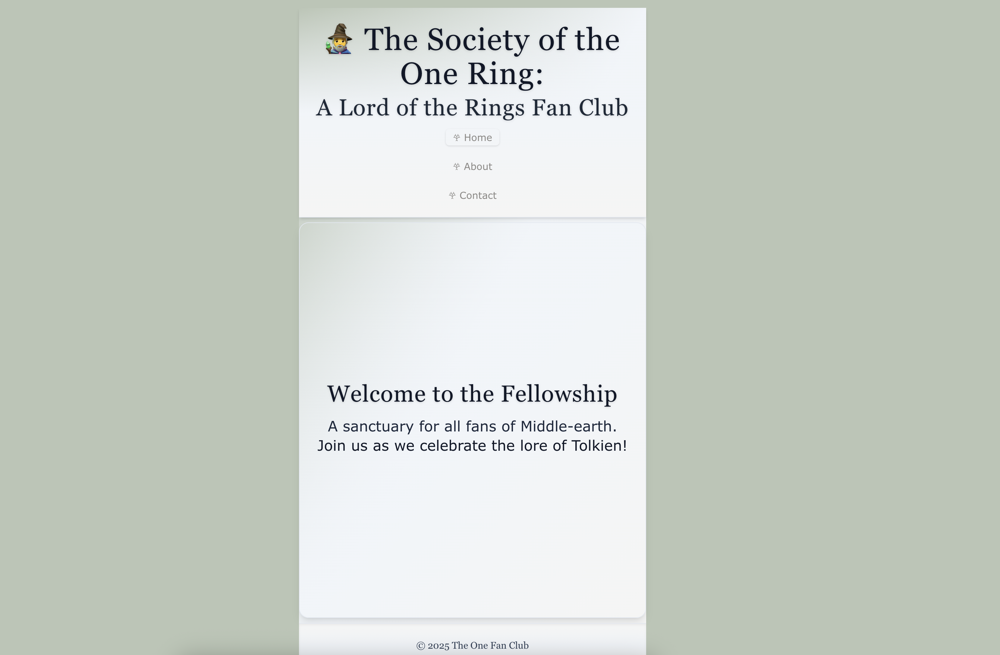
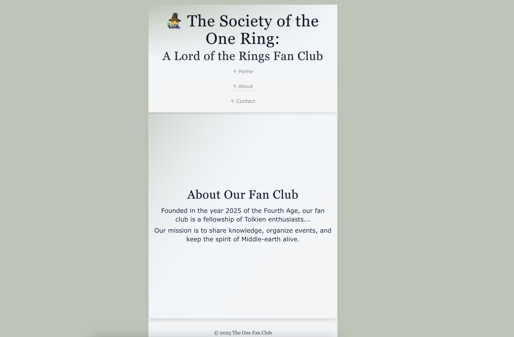
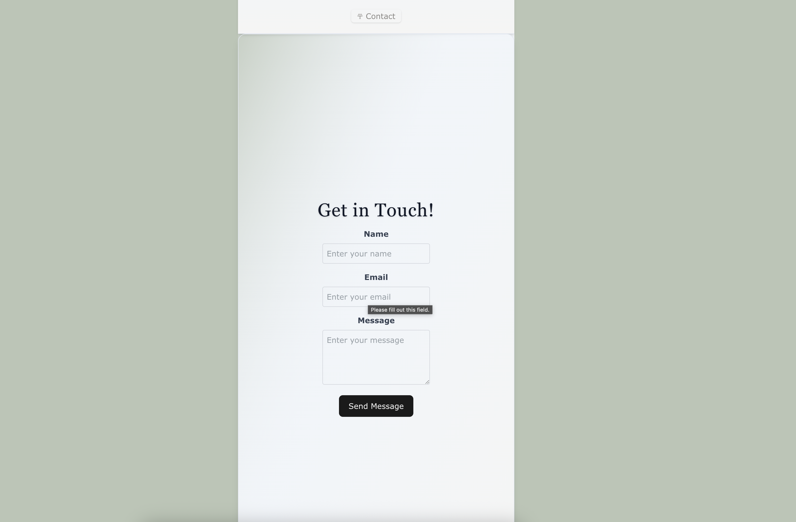
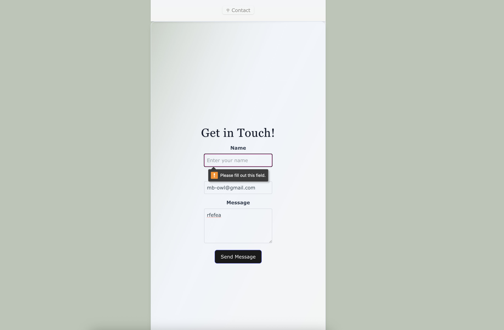

# LOTR Fan Club <div align="right"><a href="https://linkedin.com/in/mb-in-wonderland"></a> | <a href="https://github.com/mb-owl"></a></div>

<div align="center">
<!-- TODO: Add logo once UX design is finalized
  <a href="https://github.com/mb-owl/lotr-fanclub">
    
  </a>
-->

  <p align="center">
    A comprehensive Lord of the Rings fan community platform with Django backend and React frontend
    <br />
    <a href="https://github.com/mb-owl/lotr-fanclub"><strong>Explore the docs »</strong></a>
    <br />
    <br />
    <a href="https://github.com/mb-owl/lotr-fanclub">View Demo</a>
    &middot;
    <a href="https://github.com/mb-owl/lotr-fanclub/issues/new?labels=bug&template=bug-report---.md">Report Bug</a>
    &middot;
    <a href="https://github.com/mb-owl/lotr-fanclub/issues/new?labels=enhancement&template=feature-request---.md">Request Feature</a>
  </p>
</div>

<details>
  <summary>Table of Contents</summary>
  <ol>
    <li>
      <a href="#about-the-project">About The Project</a>
      <ul>
        <li><a href="#built-with">Built With</a></li>
      </ul>
    </li>
    <li>
      <a href="#getting-started">Getting Started</a>
      <ul>
        <li><a href="#prerequisites">Prerequisites</a></li>
        <li><a href="#installation">Installation</a></li>
      </ul>
    </li>
    <li><a href="#usage">Usage</a></li>
    <li><a href="#roadmap">Roadmap</a></li>
    <li><a href="#contributing">Contributing</a></li>
    <li><a href="#acknowledgments">Acknowledgments</a></li>
  </ol>
</details>

## About The Project

[](https://example.com)

LOTR Fan Club is an interactive platform for Lord of the Rings enthusiasts to connect, share their love for Tolkien's world, and engage with fellow fans. Built with a Django backend for robust data management and a React frontend for an engaging user experience.

### App Screenshots

<div align="center">
  
  
  
  
</div>

Key Features:

- 🧙‍♂️ Comprehensive character and lore database
- 🌍 Interactive Middle-earth map
- 💬 Community discussions and forums
- 📅 Fan events and meetups
- 📚 Tolkien literature database
- 🎬 Movie and series information

<p align="right">(<a href="#readme-top">back to top</a>)</p>

### Built With

- 
- 
- 
- 
- 

## Getting Started

To get a local copy up and running, follow these steps.

### Prerequisites

- Python 3.13 or higher
- Node.js 16.0 or higher
- Docker and Docker Compose
- Git

### Installation

1. Clone the repository

   ```sh
   git clone <your-repo-url>
   ```

2. Start the development environment with Docker Compose

   ```sh
   cd lotr-fanclub
   docker-compose up --build
   ```

3. The application will be available at:
   - Frontend: http://localhost:3000
   - Backend API: http://localhost:8000
   - Admin Interface: http://localhost:8000/admin

## Usage

### Key Features

1. **Community Features**

   - Join discussions about your favorite characters
   - Share fan theories and insights
   - Connect with fellow LOTR enthusiasts

2. **Lore Explorer**

   - Explore the interactive map of Middle-earth
   - Browse detailed character biographies
   - Discover historical timeline of events

3. **Events & Activities**
   - Participate in LOTR-themed events
   - Join trivia contests
   - Organize local meetups

## Roadmap

- [x] Basic community features
- [x] Character database
- [ ] Interactive map implementation
- [ ] Advanced community features
  - [ ] Private messaging
  - [ ] User groups
  - [ ] Event organization
- [ ] Content features
  - [ ] Lore articles
  - [ ] Timeline visualization
  - [ ] Quote database
- [ ] Integration with external APIs
  - [ ] Movie information
  - [ ] Book details
  - [ ] Merchandise links

See the [open issues](https://github.com/mb-owl/lotr-fanclub/issues) for a full list of proposed features and known issues.

## Contributing

Contributions are what make the open source community such an amazing place to learn, inspire, and create. Any contributions you make are **greatly appreciated**.

1. Fork the Project
2. Create your Feature Branch (`git checkout -b feature/AmazingFeature`)
3. Commit your Changes (`git commit -m 'Add some AmazingFeature'`)
4. Push to the Branch (`git push origin feature/AmazingFeature`)
5. Open a Pull Request

## Acknowledgments

- [Django](https://www.djangoproject.com/) - The web framework that powers our backend
- [React](https://reactjs.org/) - For building our interactive UI
- [J.R.R. Tolkien](https://www.tolkienestate.com/) - For creating the magical world that brings us together
- The amazing LOTR fan community

<p align="right">(<a href="#readme-top">back to top</a>)</p>

<!-- MARKDOWN LINKS & IMAGES -->

[product-screenshot]: images/lotr-screenshot1.png
